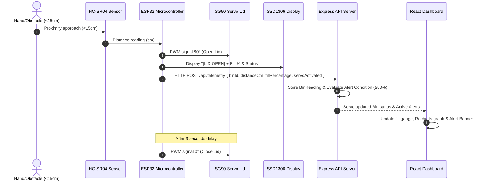

# 🗑️ SmartBin - Full-Stack IoT Smart Garbage Monitoring System


**SmartBin** is an end-to-end Internet of Things (IoT) waste monitoring and management system. It pairs microcontrollers (ESP32) equipped with ultrasonic sensors, OLED displays, and servo motors with a real-time Express/MongoDB backend and a modern React dashboard.

---

## 📐 System Architecture

### 1. High-Level System Architecture Diagram

```mermaid
flowchart TB
    subgraph Hardware ["Hardware Layer (Smart Bin Node)"]
        ESP32["ESP32 Microcontroller"]
        HCSR04["HC-SR04 Ultrasonic Sensor"]
        OLED["SSD1306 OLED Display (128x64)"]
        SERVO["SG90 Servo Motor (Lid Auto-Open)"]
        
        HCSR04 -->|Distance Pulse| ESP32
        ESP32 -->|I2C Fill Bar & Status| OLED
        ESP32 -->|PWM Lid Trigger (<15cm)| SERVO
    end

    subgraph Transport ["Network Layer"]
        WIFI["Wi-Fi / HTTP POST"]
        ESP32 -->|Telemetry JSON Payload| WIFI
    end

    subgraph Backend ["Backend Layer (Node.js + Express)"]
        API["REST API Router (/api/telemetry, /api/bins, /api/alerts)"]
        SIM["Telemetry Simulation Worker"]
        DB_STORE["Mongoose ODM / In-Memory Fallback Engine"]
        
        WIFI --> API
        API --> DB_STORE
        SIM --> DB_STORE
    end

    subgraph Database ["Persistence Layer"]
        MONGO[("MongoDB Database\n(User, Bin, BinReading, Alert)")]
        DB_STORE -.-> MONGO
    end

    subgraph Dashboard ["Frontend Layer (React + Vite + Recharts)"]
        UI["React Admin Dashboard"]
        STATS["Real-time Stat Cards"]
        CHART["Recharts Historical Fill Trend"]
        MAP["GIS Radar Map Visualizer"]
        ALERT_BANNER["Full-Bin Critical Alert Banner"]
        
        DB_STORE -->|JSON Polling Stream| UI
        UI --> STATS
        UI --> CHART
        UI --> MAP
        UI --> ALERT_BANNER
    end
```

---

### 2. Telemetry Flow & Automatic Lid Sequence



---

## ⚡ Key Features

- **📏 Ultrasonic Fill Distance Calculation:** Continuous distance measurement converts depth into intuitive fill percentage (`0% = Empty`, `100% = Full`).
- **📊 Real-Time Dynamic Status Classification:** Automatic status assignment (`Empty`: `<40%`, `Half`: `40-79%`, `Full`: `≥80%`).
- **🚨 Full-Bin Alert System:** Automatic critical alert generation when bins exceed threshold, with real-time UI banners and resolution workflow.
- **📈 Interactive Historical Fill Trend:** Responsive Recharts graph filtering aggregate or per-bin fill levels over time.
- **🗺️ Live GIS Radar Location Map:** Spatial radar visualizer mapping bin locations with pulse indicators and status popups.
- **🤖 Automatic Servo Lid Opener:** Motion/hand detection within 15 cm automatically opens the bin lid via SG90 servo for hands-free disposal.
- **🖥️ On-Bin SSD1306 OLED Display:** Shows live fill percentage, graphic progress bar, status text, and lid open indicators directly on physical hardware.
- **🔮 Built-In Telemetry Simulator:** Out-of-the-box demo mode simulating live sensor updates, fill boosts, and automated lid operations without physical hardware required.
- **🛡️ Database Fallback Layer:** Automatic seamless fallback to an In-Memory data store if local MongoDB service is offline.

---

## 🔌 Hardware Wiring & Pin Mapping

| Component | Component Pin | ESP32 GPIO Pin | Description |
|---|---|---|---|
| **HC-SR04 Ultrasonic** | `VCC` | `5V / VIN` | Power Supply |
| | `GND` | `GND` | Ground |
| | `TRIG` | `GPIO 5` | Ultrasonic Trigger Output |
| | `ECHO` | `GPIO 18` | Ultrasonic Echo Input |
| **SG90 Servo Motor** | `VCC (Red)` | `5V` | Power Supply |
| | `GND (Brown/Black)`| `GND` | Ground |
| | `PWM (Yellow/Orange)`| `GPIO 13` | Servo Pulse Width Signal |
| **SSD1306 OLED Display**| `VCC` | `3.3V / 5V` | Power Supply |
| | `GND` | `GND` | Ground |
| | `SDA` | `GPIO 21` | I2C Data Line |
| | `SCL` | `GPIO 22` | I2C Clock Line |

---

## 🛠️ Technology Stack

- **Frontend:** React 18, Vite, Tailwind-styled modern CSS, Lucide Icons, Recharts
- **Backend:** Node.js, Express.js, Cors, JWT
- **Database:** MongoDB & Mongoose (with built-in In-Memory fallback store)
- **Firmware:** C++ / Arduino Framework for ESP32 (`WiFi.h`, `HTTPClient.h`, `Adafruit_SSD1306.h`, `ESP32Servo.h`)

---

## 🚀 Quick Start Guide

### Prerequisites
- Node.js (v18 or higher)
- Arduino IDE (for ESP32 hardware flashing)

---

### Step 1: Start the Backend Server

```bash
cd backend
npm install
npm start
```

The Express server will launch on `http://localhost:5000`. If local MongoDB is running, it connects automatically; otherwise, it activates the **In-Memory Fallback Engine** for instant preview!

---

### Step 2: Start the React Frontend Dashboard

Open a second terminal:

```bash
cd frontend
npm install
npm run dev
```

Open your browser to `http://localhost:3000` to access the SmartBin Dashboard!

---

## 📡 REST API Documentation

### 1. Bin Management
- `GET /api/bins` - Retrieve list of all smart bins & system statistics
- `GET /api/bins/:id` - Retrieve detailed information for a specific bin
- `POST /api/bins` - Register a new smart bin node
- `PUT /api/bins/:id` - Update bin configuration (name, location, capacity, depth height)
- `DELETE /api/bins/:id` - Remove a bin from system
- `POST /api/bins/:id/empty` - Mark a bin as cleared/emptied (resets fill to 0%)

### 2. Sensor Telemetry
- `POST /api/telemetry` - Ingest raw sensor reading from ESP32 node
  ```json
  {
    "binId": "BIN-101",
    "distanceCm": 18.5,
    "servoActivated": true
  }
  ```
- `GET /api/telemetry/history` - Fetch global historical readings
- `GET /api/telemetry/history/:binId` - Fetch historical readings for a specific bin

### 3. Alerts Management
- `GET /api/alerts` - List active and resolved alerts
- `PUT /api/alerts/:id/acknowledge` - Mark alert as acknowledged
- `PUT /api/alerts/:id/resolve` - Resolve active alert

### 4. Telemetry Simulation Engine
- `GET /api/simulation/status` - Check live simulation worker status
- `POST /api/simulation/toggle` - Start or pause automated simulation worker

---

## 📟 ESP32 Firmware Instructions

1. Open `firmware/smart_bin_esp32/smart_bin_esp32.ino` in Arduino IDE.
2. Install required libraries via Arduino Library Manager:
   - `Adafruit SSD1306` & `Adafruit GFX Library`
   - `ESP32Servo`
3. Update `ssid`, `password`, and `serverUrl` (e.g. `http://YOUR_LAPTOP_IP:5000/api/telemetry`).
4. Select **ESP32 Dev Module** board and flash the firmware.
5. The OLED display will light up showing fill level percentage and status bar!

---

## 📄 License
Distributed under the MIT License. See `LICENSE` for details.
